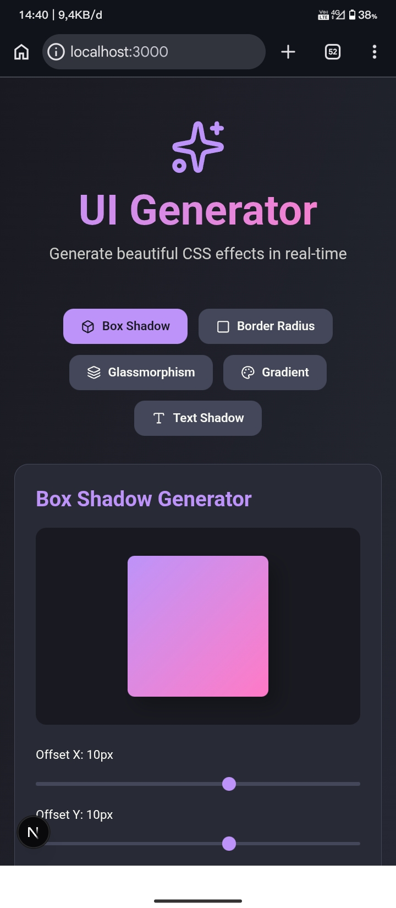
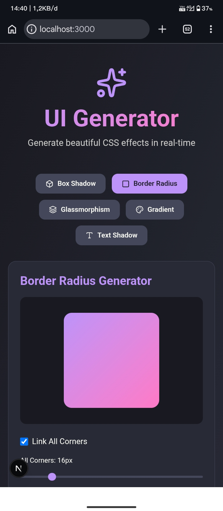
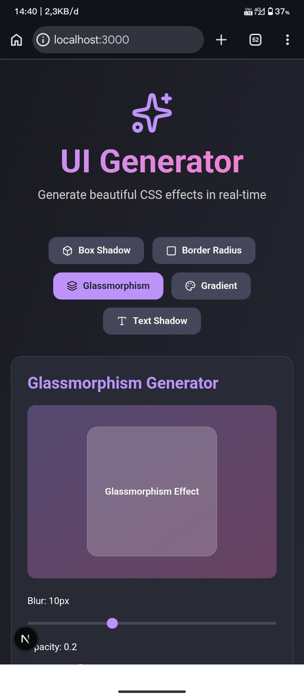
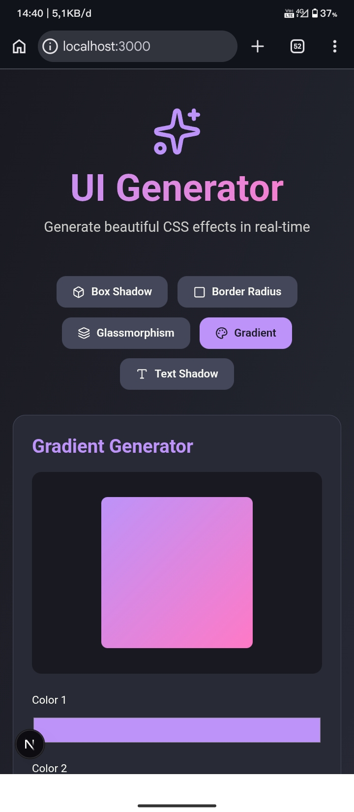
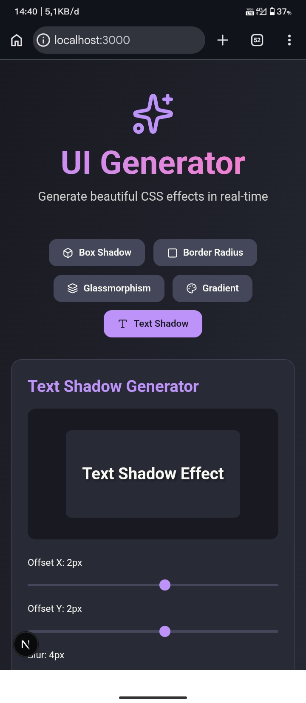

<div align="center">

# UI Generator

[](https://www.typescriptlang.org/)
[](https://reactjs.org/)
[](https://nextjs.org/)
[](https://tailwindcss.com/)
[](https://www.framer.com/motion/)
[](https://lucide.dev/)

</div>

A professional UI component and CSS effect generator built with Next.js, TypeScript, and Tailwind CSS. Generate beautiful CSS effects in real-time with live preview and copy-to-clipboard functionality.

## Demo / Screenshot

<table align="center">
  <tr align="center">
    <td></td>
    <td></td>
    <td></td>
    <td></td>
    <td></td>
  </tr>
</table>

## Features

- Box Shadow Generator with real-time preview
- Border Radius Generator with linked/unlinked corners
- Glassmorphism Generator
- Gradient Generator
- Text Shadow Generator
- Live CSS code generation
- One-click copy to clipboard
- Dracula theme design
- Fully responsive

## Tech Stack

- Next.js 16
- TypeScript
- Tailwind CSS
- Framer Motion
- Lucide Icons

## Installation

### Prerequisites

- Node.js 18.x or higher
- npm or yarn or pnpm

### Setup

#### Option 1: Manual setup

1. Clone the repository

```bash
git clone https://github.com/atex-ovi/ui-generator.git
cd ui-generator
```

2. Install dependencies

```bash
npm install
```

3. Run the development server

```bash
npm run dev
```

4. Open your browser and navigate to

http://localhost:3000

#### Option 2: Using setup script (recommended)
> [!NOTE]
> After clone the repositories, you can run:
```bash
./script/setup.sh
```

> [!TIP]
> If you encounter a permission error, run:
```bash
chmod +x script/setup.sh
```

## Usage

### Box Shadow Generator

1. Adjust the sliders to control:
   - Offset X (horizontal position)
   - Offset Y (vertical position)
   - Blur radius
   - Spread radius
   - Shadow color
   - Opacity
2. Toggle "Inset Shadow" for inner shadow effects
3. Copy the generated CSS code with one click
4. The preview updates in real-time

### Border Radius Generator

1. Use the slider to adjust border radius
2. Toggle "Link All Corners" to control corners individually or together
3. Copy the generated CSS code

## Building for Production

```bash
npm run build
npm start
```

## Contributing

Contributions are welcome! If you want to develop or improve UI Generator:

1. Fork the repository
2. Create your feature branch (`git checkout -b feature/AmazingFeature`)
3. Commit your changes (`git commit -m 'Add some AmazingFeature'`)
4. Push to the branch (`git push origin feature/AmazingFeature`)
5. Open a Pull Request

Feel free to open issues for bugs or feature requests.

Happy coding!

## License

MIT License

Copyright (c) 2026 Atex Ovi

Permission is hereby granted, free of charge, to any person obtaining a copy
of this software and associated documentation files (the "Software"), to deal
in the Software without restriction, including without limitation the rights
to use, copy, modify, merge, publish, distribute, sublicense, and/or sell
copies of the Software, and to permit persons to whom the Software is
furnished to do so, subject to the following conditions:

The above copyright notice and this permission notice shall be included in all
copies or substantial portions of the Software.

THE SOFTWARE IS PROVIDED "AS IS", WITHOUT WARRANTY OF ANY KIND, EXPRESS OR
IMPLIED, INCLUDING BUT NOT LIMITED TO THE WARRANTIES OF MERCHANTABILITY,
FITNESS FOR A PARTICULAR PURPOSE AND NONINFRINGEMENT. IN NO EVENT SHALL THE
AUTHORS OR COPYRIGHT HOLDERS BE LIABLE FOR ANY CLAIM, DAMAGES OR OTHER
LIABILITY, WHETHER IN AN ACTION OF CONTRACT, TORT OR OTHERWISE, ARISING FROM,
OUT OF OR IN CONNECTION WITH THE SOFTWARE OR THE USE OR OTHER DEALINGS IN THE
SOFTWARE.
